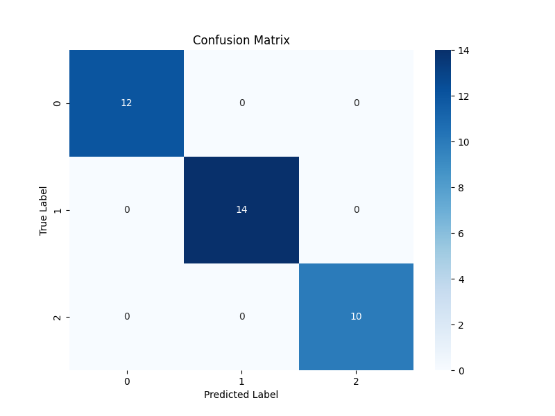
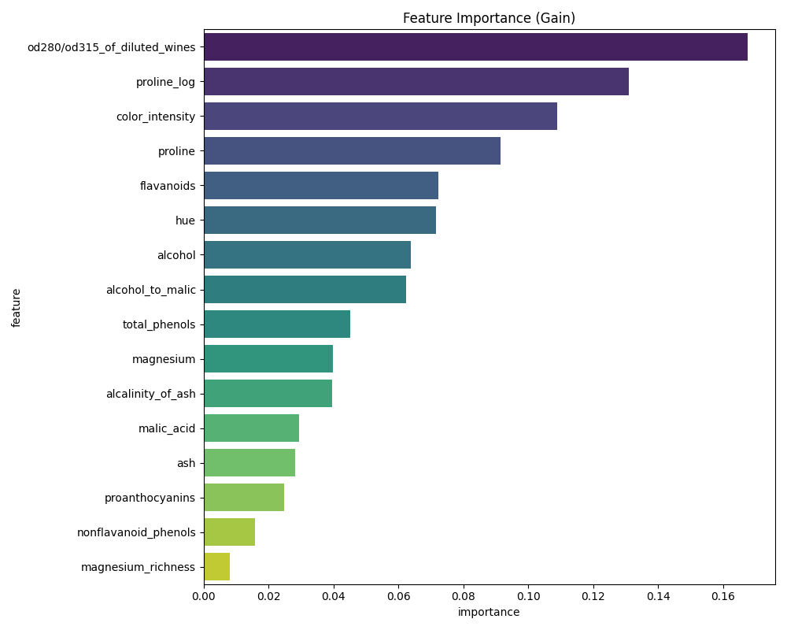

# XGBoost Model Evaluation Report

## Model Performance

### Cross-Validation (Training Set)
- **Mean Accuracy**: 0.9862 (+/- 0.0276)
- **Folds**: 5

### Test Set Metrics
- **Accuracy**: 1.0000
- **Precision (Weighted)**: 1.0000
- **Recall (Weighted)**: 1.0000
- **F1 Score (Weighted)**: 1.0000

### Per-Class Metrics
| Class | Precision | Recall | F1-Score | Support |
|---|---|---|---|---|
| 0 | 1.0000 | 1.0000 | 1.0000 | 12.0 |
| 1 | 1.0000 | 1.0000 | 1.0000 | 14.0 |
| 2 | 1.0000 | 1.0000 | 1.0000 | 10.0 |

## Confusion Matrix

## Feature Importance

## Recommendations
- The model achieves strong performance with an accuracy of 100.00%
  on the test set.
- Check feature importance to understand key drivers (e.g., alcohol_to_malic ratio, proline).
